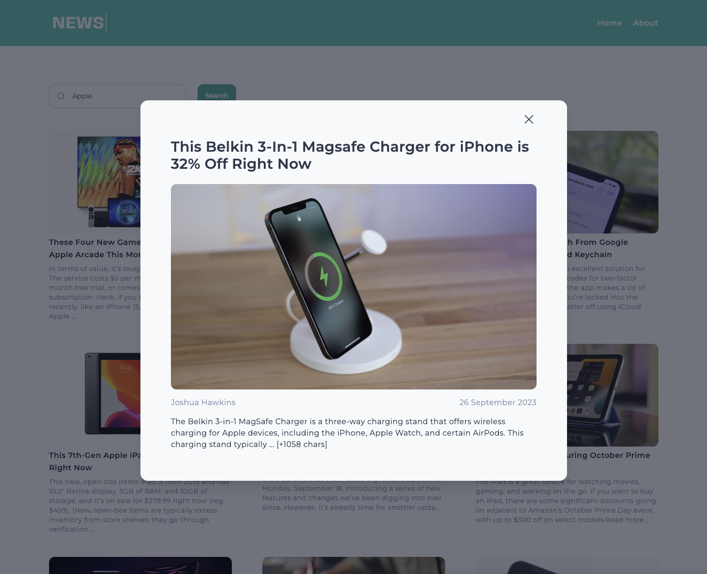

## News App

The project is to show articles with title, image and description



## Table of contents

- [News App](#news-app)
- [Table of contents](#table-of-contents)
- [Demo](#demo)
- [Getting Started](#getting-started)
- [Tech I used](#tech-i-used)
- [Feature](#feature)
- [Future Plan](#future-plan)
- [Design](#design)
- [Learn More](#learn-more)

## Demo

You can see my project on Vercel [Demo Link](https://news-app-coral-theta.vercel.app/)

## Getting Started

1. Install node_modules dependencies`npm install or yarn install`

2. Sign up an API Key from [API Documentation](https://newsapi.org/docs)

3. Create an ``.env.local`` files on the root path in order to run execute API
   
```bash
NEXT_PUBLIC_NEWS_API=Your API Key
```

4. Run the development server:

```bash
npm run dev
```

Go to [Local Dev Link](http://localhost:3000)

## Tech I used

- React
- Next.js 13
- TailwindCSS
- React Query
- React Icon
- TailwildCSS UI

## Feature

- Data handling
- Responsive Design
- Detail Page on the modal
- Status of error handling, loading indicators, pagination, sorting, searching
- Deploy to Vercel

## Future Plan

- Date range filter

## Design

Font

- [Montserrat](https://fonts.google.com/specimen/Montserrat)

Color

- [Teal & Slate](https://tailwindcss.com/docs/customizing-colors)

## Learn More

To learn more about the project, take a look at the following resources:

- [React Query Documentation](https://tanstack.com/query/v4/docs/react/quick-start)

- [Date Range Tutorial](https://reactjsguru.com/how-to-make-date-range-filter-in-react-js/)